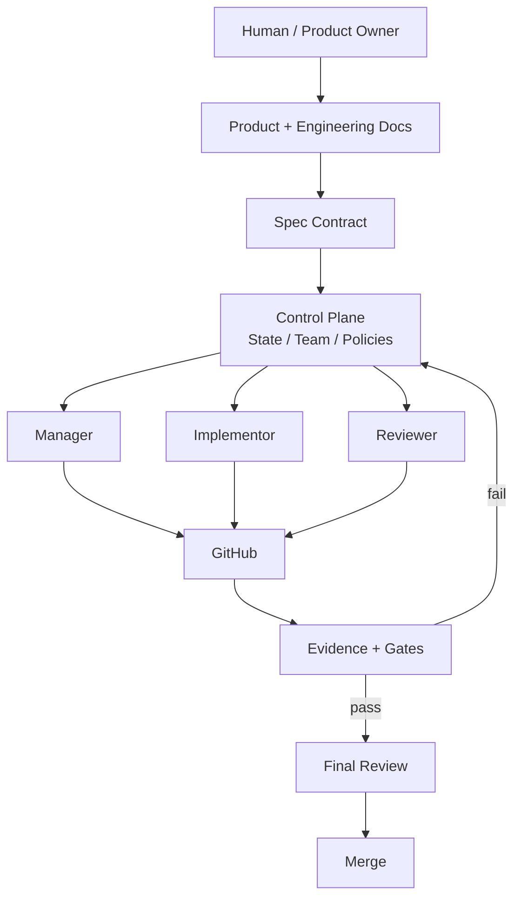
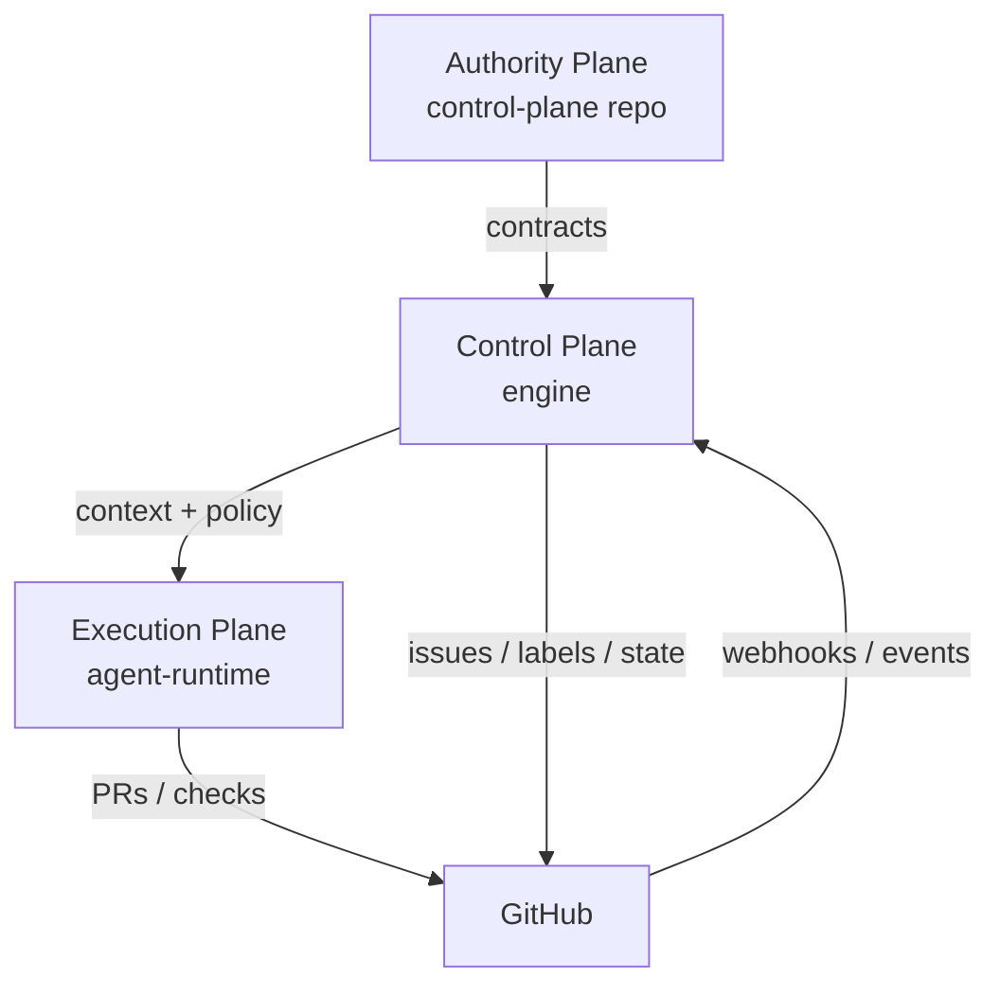
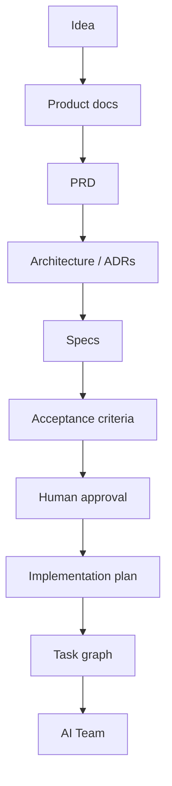
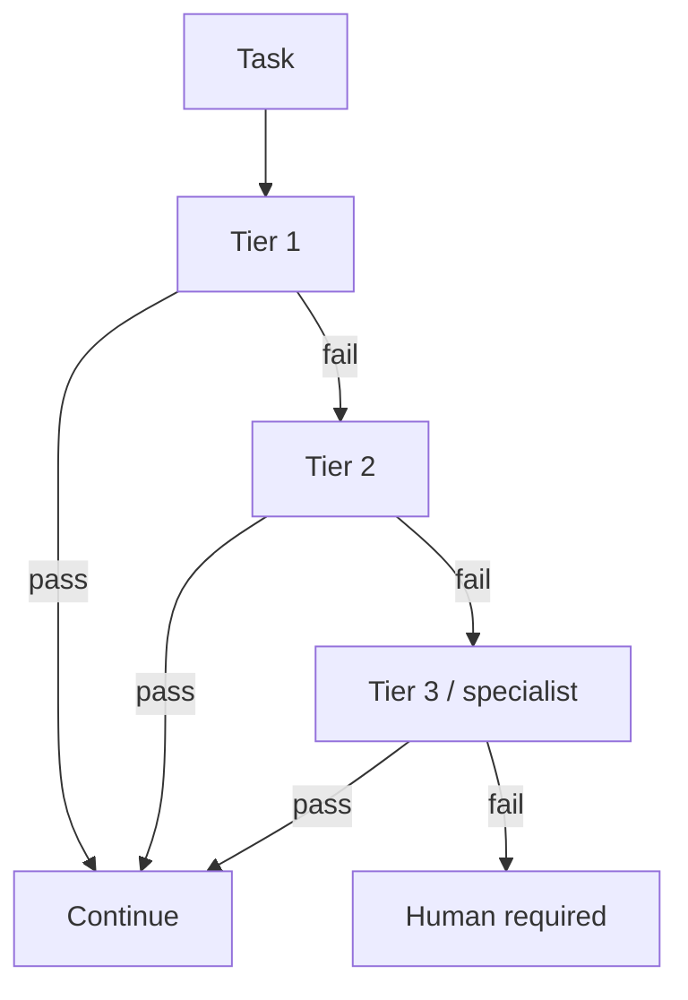
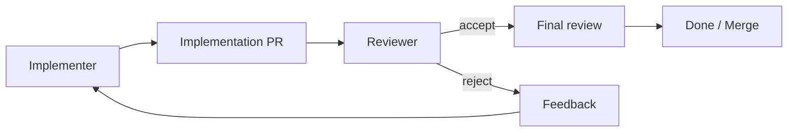

# Diagrams

## AI Team flow

## Three planes

## Docs-first cascade

## Model escalation

## Review separation

Source files for mermaid live alongside architecture docs; render in GitHub or compatible viewers.
